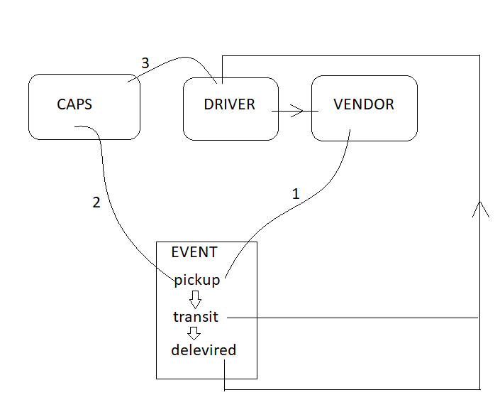
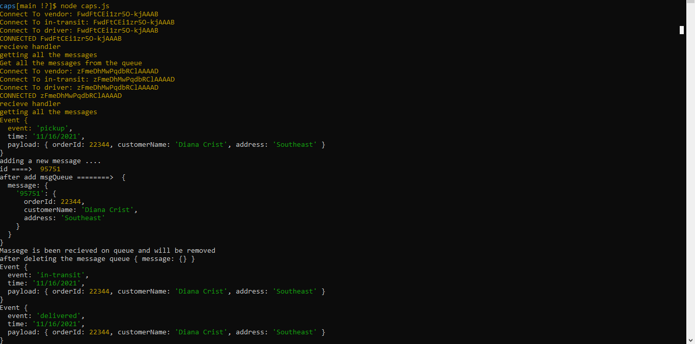
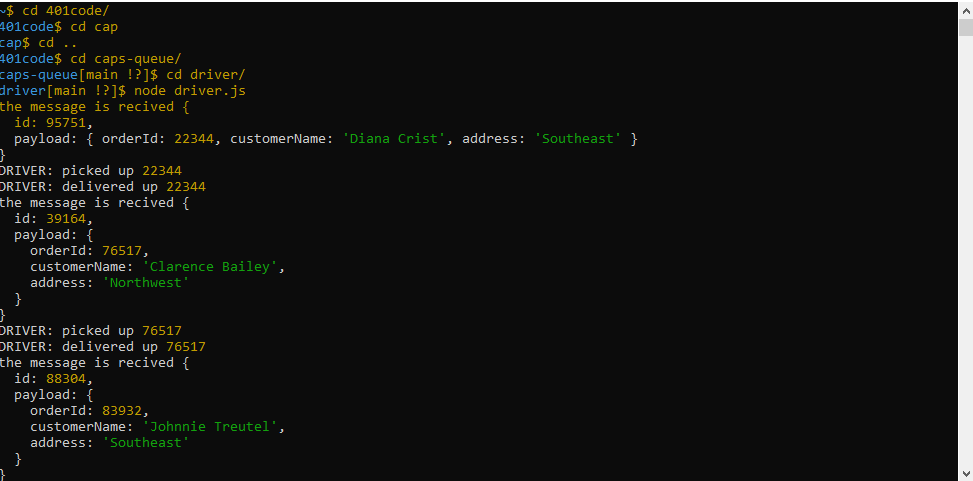
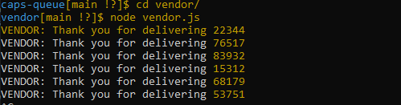
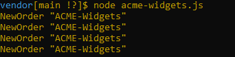

# queue-messages
# Author : Samah hamed
# Setup : 
.env =>{ store name, address, customer name, order id }

# Running the app :
 node caps.js + node driver.js + node vendor.js
Endpoint : /caps

# Whiteboard :

# Test 👍
### Caps

### driver 

### vendor

### acm-wedgits 
